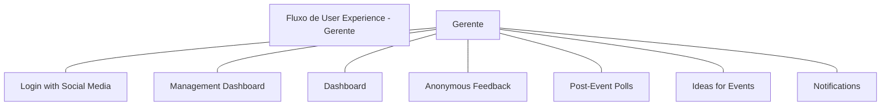
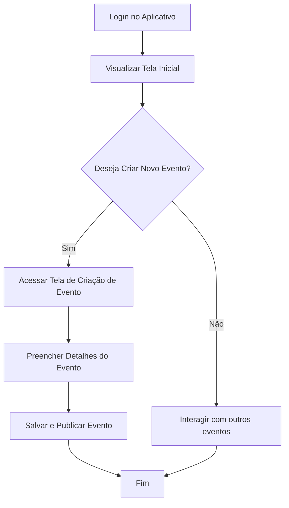
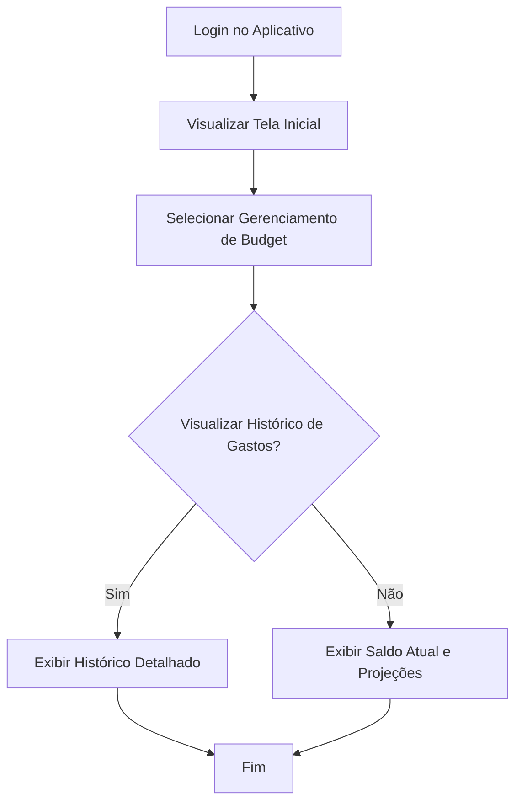
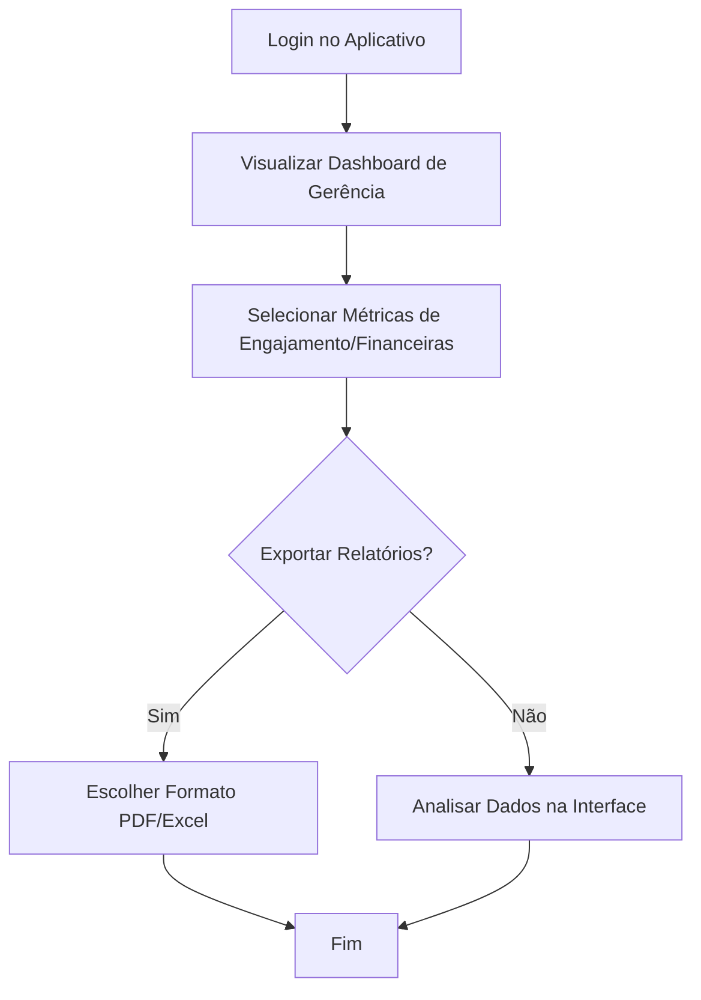

### UML - Fluxo de User Experience para "Rolê Connect"

#### **Definição de ROLES**

1. **Funcionário Comum**:
   - Pode criar eventos.
   - Pode participar de eventos.
   - Pode gerenciar seu budget individual.
   - Pode interagir em chats e galerias.
   - Pode enviar feedback anônimo.

2. **Gerente**:
   - Pode visualizar o "Dashboard de Gerência".
   - Pode aprovar ou rejeitar eventos (se necessário).
   - Pode acessar relatórios financeiros e métricas de engajamento.
   - Pode gerenciar feedbacks e tendências de eventos.

---

### UML - Fluxo de User Experience para "Rolê Connect"

#### **Definição de ROLES**

1. **Funcionário Comum**:
   - Pode criar eventos.
   - Pode participar de eventos.
   - Pode gerenciar seu budget individual.
   - Pode interagir em chats e galerias.
   - Pode enviar feedback anônimo.

2. **Gerente**:
   - Pode visualizar o "Dashboard de Gerência".
   - Pode aprovar ou rejeitar eventos (se necessário).
   - Pode acessar relatórios financeiros e métricas de engajamento.
   - Pode gerenciar feedbacks e tendências de eventos.

---

#### **Diagrama UML - Fluxo de Caso de Uso do Funcionário Comum**

```mermaid
graph TD
    title["Fluxo de User Experience - Funcionário Comum"]
    
    Func[Funcionário]
    
    Login[Login with Social Media]
    Dash[Dashboard]
    CreateEvent[Create Event]
    ViewEvent[View Event Details]
    Budget[Manage Budget]
    Carpool[Carpool System]
    Profile[Profile Management]
    History[History of Events]
    Notifications[Notifications]
    Gallery[Gallery of Photos]
    Polls[Post-Event Polls]
    Voting[Voting System]
    Ideas[Ideas for Events]
    Feedback[Anonymous Feedback]
    SplitBill[Split Bill System]
    Recommendations[Recommendations]
    Calendar[Calendar Integration]
    
    Func --- Login
    Func --- Dash
    Func --- CreateEvent
    Func --- ViewEvent
    Func --- Budget
    Func --- Carpool
    Func --- Profile
    Func --- History
    Func --- Notifications
    Func --- Gallery
    Func --- Polls
    Func --- Voting
    Func --- Ideas
    Func --- Feedback
    Func --- SplitBill
    Func --- Recommendations
    Func --- Calendar
```

#### **Diagrama UML - Fluxo de Caso de Uso do Gerente**

---

### **Descrição do Fluxo**

#### **Funcionário Comum**
1. **Login**:
   Funcionário realiza login usando e-mail corporativo ou redes sociais.
   
2. **Dashboard**:
   Após login, o funcionário visualiza a lista de eventos próximos, saldo de budget, e notificações importantes.

3. **Criação de Evento**:
   Caso deseje criar um evento, acessa a tela de criação onde insere detalhes como nome, data, local, limite de participantes, orçamento por pessoa, etc.

4. **Detalhes de Evento**:
   Funcionário pode visualizar eventos criados por outros, confirmar participação e interagir no chat do evento.

5. **Gerenciamento de Budget**:
   Acompanhamento do saldo mensal disponível para eventos, histórico de gastos, e previsão de custos futuros.

6. **Sistema de Caronas**:
   Funcionário pode oferecer ou solicitar caronas para eventos.

7. **Perfil e Histórico**:
   Acessa tela de perfil para gerenciar informações básicas e visualizar eventos passados.

8. **Galeria de Fotos**:
   Participa interagindo com fotos de eventos (curtir, comentar, etc.).

9. **Enquetes Pós-Evento**:
   Avalia eventos passados e fornece feedback.

10. **Recomendações e Calendário**:
    Recebe sugestões de eventos baseados em suas preferências e visualiza calendário integrado.

---

#### **Gerente**
1. **Login**:
   Gerente realiza login usando e-mail corporativo ou redes sociais.

2. **Dashboard de Gerência**:
   Após login, gerente acessa métricas globais de engajamento, gastos, e feedbacks dos eventos.

3. **Feedback e Sugestões**:
   Analisa feedbacks anônimos e sugestões de melhorias para eventos futuros.

4. **Relatórios e Análises**:
   Exporta dados financeiros e de engajamento para relatórios personalizados.

5. **Notificações e Alertas**:
   Recebe alertas de orçamento excedido ou baixa participação.

---

### **Exemplo de Fluxo de Atividade**

#### **Fluxo de Criação de Evento (Funcionário Comum)**

---

#### **Fluxo de Gerenciamento de Budget (Funcionário Comum)**

---

#### **Fluxo de Gerência e Relatórios (Gerente)**

---

### **Descrição do Fluxo**

#### **Funcionário Comum**
1. **Login**:
   Funcionário realiza login usando e-mail corporativo ou redes sociais.
   
2. **Dashboard**:
   Após login, o funcionário visualiza a lista de eventos próximos, saldo de budget, e notificações importantes.

3. **Criação de Evento**:
   Caso deseje criar um evento, acessa a tela de criação onde insere detalhes como nome, data, local, limite de participantes, orçamento por pessoa, etc.

4. **Detalhes de Evento**:
   Funcionário pode visualizar eventos criados por outros, confirmar participação e interagir no chat do evento.

5. **Gerenciamento de Budget**:
   Acompanhamento do saldo mensal disponível para eventos, histórico de gastos, e previsão de custos futuros.

6. **Sistema de Caronas**:
   Funcionário pode oferecer ou solicitar caronas para eventos.

7. **Perfil e Histórico**:
   Acessa tela de perfil para gerenciar informações básicas e visualizar eventos passados.

8. **Galeria de Fotos**:
   Participa interagindo com fotos de eventos (curtir, comentar, etc.).

9. **Enquetes Pós-Evento**:
   Avalia eventos passados e fornece feedback.

10. **Recomendações e Calendário**:
    Recebe sugestões de eventos baseados em suas preferências e visualiza calendário integrado.

---

#### **Gerente**
1. **Login**:
   Gerente realiza login usando e-mail corporativo ou redes sociais.

2. **Dashboard de Gerência**:
   Após login, gerente acessa métricas globais de engajamento, gastos, e feedbacks dos eventos.

3. **Feedback e Sugestões**:
   Analisa feedbacks anônimos e sugestões de melhorias para eventos futuros.

4. **Relatórios e Análises**:
   Exporta dados financeiros e de engajamento para relatórios personalizados.

5. **Notificações e Alertas**:
   Recebe alertas de orçamento excedido ou baixa participação.
